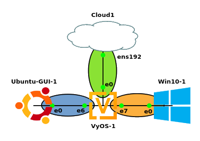

## ITS 2300 - Lab 8
### Goals 

-   Experience the setup of a caching DNS server.

-   Add DNS testing and diagnostic tools to the student toolkit.

### Pre-Lab

-   Read section 2.1 "Overview" in RFC 1035 at: <https://tools.ietf.org/html/rfc1035>

-   Review the Wireshark export guide from the lab section of blackboard.

### Toolkit

-   Tools from Previous labs

-   nslookup command line tool

-   <https://lookup.icann.org>, web based whois information

### Storyline

Intern, welcome back to the Desktop Group. Your manager was starting to get concerned that the Linux team was not going to send you back. In your lab brief, please summarize what you learned in Labs 2, 3, and 4 in your lab brief. While you were gone the other engineers started to deploy the simulation for the managed branch product. Fortunately, it is very similar to the networks that you deployed for the Linux team.

### Task 1 - Design 

1.  [Data] At the risk of "breaking the 4th wall" your faux manager, Livingston Dell, finds it interesting that Head Wall Ram needs another faux company to describe how the managed branch product will be used. Please design a network for ACME French Fry Shop using the IP assignment 172.16.0.0/16.

-   LAN 1 is a wired Ethernet LAN

    -   There are two point of sales systems

    -   One management server

    -   Ten security cameras

-   LAN2 is an 802.11 wireless LAN for customer guest access.

    -   Fewer than 200 customers per day. The WAN connection on the router gets its Internet from the local cable company who provides a public IP address and default route.

|                   |**WAN**            |**LAN1**           |**LAN2**
|--                         |--                 |--                 |--
|Description                |To Internet        |To PC1&nbsp; &nbsp; &nbsp; &nbsp; &nbsp; &nbsp; &nbsp; &nbsp; &nbsp; &nbsp; &nbsp; &nbsp; &nbsp; &nbsp;             |To PC2&nbsp; &nbsp; &nbsp; &nbsp; &nbsp; &nbsp; &nbsp; &nbsp; &nbsp; &nbsp; &nbsp; &nbsp; &nbsp; &nbsp; &nbsp; &nbsp; &nbsp; &nbsp;
|Router Interface           |eth0               |eth6               |eth7
|Network Address            |132.235.160.128    |                   |
|CIDR Netmask               |/26                |                   |
|Clien Address              | From Blackboard IP Grid|              |
|Gateway Address            |132.235.160.190    |                   |



### Task 2 - Finish the Build 

2.  Watch Class videos and [ECT Tech Nuggets](https://www.youtube.com/playlist?list=PLEA5GnkCPRTlvN_eyR99jOSsBCaV6khRS):

-   [ECT Tech Nugget - N25.0 - Ubuntu Desktop 20.04 Intro](https://www.youtube.com/watch?v=X4bfK24sbzM&list=PLEA5GnkCPRTlvN_eyR99jOSsBCaV6khRS&index=34)

-   [ECT Tech Nugget - N0.4 - Basic Diag Tools 4 - Dig and Nslookup](https://www.youtube.com/watch?v=gD-Tk1Bk7x0&list=PLEA5GnkCPRTlvN_eyR99jOSsBCaV6khRS&index=4)

3.  Use procedures from the previous labs to implement the network showing in the diagram above with the IP networks designed in Task 1.

4.  Complete ONLY the IP configuration for the Win10 and Ubuntu-GUI machine, do not configure the DNS components yet.

5.  [Data] Test with pings and traceroute to a reliable IP address.

### Task 3 - Caching DNS server

6.  VyOS, like many routers in its class, can provide network services beyond the basic routing function. The following template configuration enables the DNS service on the two client facing addresses.
```
set service dns forwarding name-server 132.235.9.75
set service dns forwarding name-server 132.235.200.41
set service dns forwarding allow-from 172.16.0.0/16
set service dns forwarding listen-address <eth6 Gateway Address>
set service dns forwarding listen-address <eth7 Gateway Address>
```

7.  [Data] Draft the configuration in a text editor and apply the configuration to the VyOS router.

8.  [Data] Test the configuration with the following dig on a console in the Ubuntu-GUI machine.

`dig www.its.ohio.edu @<eth6 gateway address>`

Checkpoint - Submit a preliminary report including your IPGrid and VyOS configuration data and the output from dig in step 8.

### Task 4 - Configure the computers

9.  Return to the Windows-Desktop virtual machine's IP settings.

10. Set the option "Use the following DNS server addresses:" with the "Preferred DNS Server" to the same IP address that was selected for the gateway/router.

11. [Data] Use the nslookup command on the windows command line to test your configuration.
`nslookup google.com`

12. Return to the Ubuntu-GUI virtual machine's IP settings and configure the primary DNS server to the be the IP address of VyOS's eth6 interface.

13. [Data] Test the configuration with the following dig on a console in the Ubuntu-GUI machine.
``dig www.its.ohio.edu``

### Task 5 - Investigating DNS

14. On the Windows 10 VM, start Wireshark and enter the filter dns.

15. Wireshark may show the computer making DNS requests for processes running in the background.

16. Open a cmd window on your Windows machine and run the command
    ``nslookup ohio.edu``

17. This command should show information about the DNS query you made, and the response.

18. The network packets associated with this request and response should be observable in Wireshark.

19. Repeat the nslookup for some other domain name.

20. Stop the Wireshark packet capture and identify the DNS request and response packets for this new request.

21. [Data] Within each of the request and response packets in Wireshark. Right click on "Domain Name System" in the middle (packet digest) window and select "Expand Subtrees", and then right click in
the middle window a second time and select "copy" and then "All visible Items".

22. [Data] Use the output of the nslookup response and/or packet capture data to identify the Query type in the request and the TTLs in the response.

### Task 6 - Inspect other DNS servers and other records

23. By default, nslookup uses the DNS server configured on your system, like Task 4.

24. The dig example at the end of Task 3 shows the extra "@" command line option to query an arbitrary DNS server.

25. [Data] By default dig requests the IPv4 A record. Dig can also request an alternate DNS records. For example:
`` dig AAAA ip6echo.net``

26. You can also configure nslookup to use any DNS server available without changing the system configuration.

27. You can access this functionality by running nslookup without any options to put it into an interactive (shell) mode. Once in this mode enter the command "server 8.8.8.8" This will direct all queries to Googles public caching DNS server until you exit that nslookup shell.

28. Now enter any valid domain name. You can also query for other record types. For example, the command "set type=MX" will request mail exchange addresses instead of the default ipv4 and ipv6 addresses.

29. [Data] Use the output of the nslookup response and/or packet capture data to show if the response is an authoritative DNS response.

### Questions

1.  Include a Draw.io based network diagram of your completed work. Full credit answers will have notations for interface numbers and IP addresses with subnet masks.

2.  Include the requested data from the Tasks in the lab.

3.  On your personal computer, and start a capture on the interface your computer is using to connect to the Internet. Enter the dns filter. Let this run for one minute while you have a "typical" set of packet captures. Identify 5 queries that you can tell are related to applications you have open, and 5 queries that you cannot easily identify.

4.  Layout an IP address space for the following Business case. Use a subnet calculator of your choosing (Mr. Saunders recommends <http://www.davidc.net/sites/default/subnets/subnets.html>)

The network manager at Head Wall Ram Inc., has been asked to deploy a new network with 4 LANs, and has selected the 10.0.0.0/8 private address space to divide up to support the following networks.

1)  Business Offices 13 Personal Computers, 15 IP Phones, and 6 Printers

2)  Call Center 70 Personal Computers, 70 IP Phones

3)  Engineering 25 Personal Computers, 25 IP Phones, 10 Large format printers

4)  Manufacturing 450 Internet connected soft foam molding tools.

WAN connectivity is provided by a Fiber internet service. The WAN network is the same WAN network information assigned in step 10.

Complete answers allow for at least 100% growth of hosts on each of the LANs. Since 172.16.0.0/16 has many more addresses than are needed and is a free private address space a complete solution does not require subnet masks smaller than /24.
